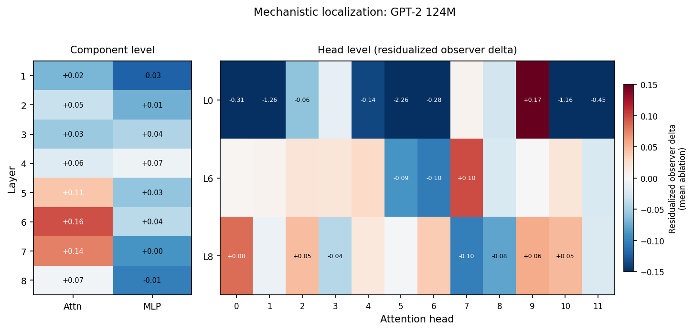

# Training-Time Design Preserves or Suppresses Internal Quality Signals in Transformer Activations

[](https://doi.org/10.5281/zenodo.19435674)
[](LICENSE)
[](https://www.python.org/downloads/)

Transformer activations contain a linearly readable decision-quality signal that survives strong controls for output confidence. The signal replicates in GPT-2, Qwen 2.5 1.5B, and Llama 3.2 1B, but diverges across families at larger scale: Qwen preserves it to 7B, while Llama 3.2 largely loses it above 1B under the same evaluation protocol.

This rules out a simple scale story. Linear readability of internal quality information appears to depend on training-time design choices: architecture, training procedure, or both.

## What this repo shows

- A linear probe on frozen activations recovers decision-quality signal that hand-designed activation statistics miss (+0.28 partial correlation after confidence controls; all tested hand-designed baselines collapse to near zero).
- On GPT-2 124M, the effect survives nonlinear deconfounding (+0.289) and 20-seed statistical hardening (+0.282 +/- 0.001).
- Named controls explain about two-thirds of the raw signal; about one-third remains unexplained.
- On GPT-2 124M at 10% flag rate, the observer catches 4,368 high-loss tokens that output confidence does not flag.
- Mechanistic analysis (GPT-2 124M only) localizes the signal to distributed mid-layer attention at layers 5-7, with subadditive redundancy across layers.

| Phase        | Question                                                 | Result                     | Takeaway                                                                                                                                                                                                                                                   |
| ------------ | -------------------------------------------------------- | -------------------------- | ---------------------------------------------------------------------------------------------------------------------------------------------------------------------------------------------------------------------------------------------------------- |
| **Phase 1**  | Does training objective change representation structure? | **Yes**                    | FF induces sparser, lower-rank, more concentrated representations than BP, independent of overlay and normalization confounders.                                                                                                                           |
| **Phase 2a** | Does FF goodness faithfully read BP activations?         | **No**                     | `sum(h²)` collapses into a confidence proxy after controlling for logit margin and activation norm.                                                                                                                                                        |
| **Phase 2b** | Can co-training rescue the observer?                     | **Weakly**                 | Denoising produced a small positive partial correlation (+0.066), but with much weaker raw predictive utility.                                                                                                                                             |
| **Phase 3**  | Do alternative hand-designed observers work?             | **No**                     | All passive structural observers collapse to near-zero partial correlation under proper controls.                                                                                                                                                          |
| **Phase 4**  | Can a learned observer head recover signal?              | **Yes**                    | Binary-trained linear heads on frozen BP activations: partial corr +0.28, seed agreement +0.36.                                                                                                                                                            |
| **Phase 5**  | Does this transfer to transformers?                      | **Yes**                    | On frozen GPT-2 124M: partial corr +0.282 +/- 0.001, seed agreement +0.99. Signal peaks at layer 8 of 12. Layer 8 retains +0.099 after a strong output-side control (MLP on last-layer activations).                                                       |
| **Phase 6**  | Does the signal catch errors confidence misses?          | **Yes**                    | On GPT-2 124M, at 10% flag rate, the layer 8 observer catches 4,368 high-loss tokens (5.2% of test set) that output confidence does not flag.                                                                                                              |
| **Phase 7**  | How does this compare to SAE-based probes?               | **Raw observer wins**      | A 768-dim linear observer outperforms a 24,576-feature SAE probe (+0.290 vs +0.255 partial corr). Combining all three channels catches substantially more errors than any single channel.                                                                  |
| **Phase 8**  | Does the signal persist across model scale?              | **Yes**                    | Partial corr +0.279 to +0.290 across GPT-2 124M to 1.5B. Output-independent component increases from +0.099 to +0.174 across this scaling curve. Seed agreement 0.88-0.95 (0.877-0.952). Peak at roughly two-thirds depth within GPT-2.                    |
| **Phase 9**  | Does the signal replicate outside GPT-2?                 | **Architecture-dependent** | At 1-1.5B, all three families replicate. At larger scale, Qwen retains it across all sizes to 7B (peaking at 1.5B, +0.284) while Llama 3.2 weakens from 1B to 3B (+0.250 to +0.021). Linear readability is modulated by architectural or training choices. |

## Why this matters

This signal survives confidence control. Many probing results report total correlation with error, which can be largely redundant with output confidence. The gap is severe: the most natural hand-designed observer (FF goodness) achieves AUC 0.923 against token loss but partial correlation -0.056 after confidence controls. The signal was a confidence proxy. This project measures the component that remains after confidence is removed. That is why the headline numbers are smaller (+0.28 partial corr, ~8% of residual loss variance, versus raw +0.55). In practical terms, on GPT-2 124M at 10% flag rate the observer catches 4,368 high-loss tokens that confidence misses entirely.

Mid-layer activations retain decision-quality information that standard output confidence does not expose. This gap could reflect information the output layer actively discards, information it could use but doesn't, or geometric properties of mid-layer representations that don't persist through later transformations. The current evidence does not distinguish these explanations. Within families that preserve the signal, output-based monitoring captures a shrinking fraction across the GPT-2 scaling curve (34% output-independent at 124M, 60% at 1.5B).

What distinguishes this from related work is the partial correlation evaluation. Kramár et al. report total correlation for production probes. CCS (Burns et al.) uses unsupervised contrastive methods where confidence control is not directly applicable. "A Single Direction of Truth" probes for hallucination, a different target. The comparison is methodological, not a claim that all related work is confidence-confounded.

### The faithfulness bar

Observability was evaluated against three tests.

- **Correlation.** Does the observer signal track decision-relevant metrics beyond what cheap baselines capture? _Passed at 1-1.5B across three families; architecture-dependent at larger scale._ Partial correlation +0.250 to +0.290 across GPT-2 (124M-1.5B), Qwen 2.5 1.5B, and Llama 3.2 1B, after controlling for confidence and activation norm (Phases 4-5, 8-9). At larger scale, Qwen retains it across all sizes to 7B (peaking at 1.5B, +0.284) while Llama 3.2 weakens from 1B to 3B (+0.250 to +0.021) and Llama 3.1 8B shows +0.088.
- **Prediction.** Can the observer rank likely failures in a way that complements output confidence? _Passed on GPT-2 124M._ 4,368 exclusive high-loss catches at 10% flag rate (Phase 6). Three-channel monitoring catches substantially more errors than any single channel (Phase 7). Not yet tested at larger model sizes.
- **Intervention.** Does removing the signal degrade performance? _Partial._ Directional ablation (Phase 5f) shows weak but bidirectional causal evidence (monotonic dose-response, 3x amplification targeting ratio). Mean-ablation patching localizes the signal to attention layers 5-7, with layer 6 showing the largest residualized effect (+0.156). Composition tests reveal subadditive redundancy: the signal is distributed across components, not reducible to a single circuit.

## Phases 1-3: why hand-designed observers fail (complete)

The project began by asking whether structural metrics on frozen activations could serve as per-example quality signals. Three phases tested this systematically, and the answer is no.

Phase 1 compared Forward-Forward and backpropagation representations on MLPs. FF produces genuinely sparser, lower-rank activations, but label overlay (not local learning) drives the probe accuracy advantage. Structural legibility is real; it just doesn't buy you per-example observability.

Phase 2 tested FF goodness (`sum(h²)`) as a passive observer on BP activations. Raw correlation with loss is strong (Spearman -0.725, AUC 0.923), but partial correlation controlling for confidence (logit margin; transformer phases use max softmax) and activation norm is **-0.056**. The independent component vanishes. `sum(h²)` collapses into activation energy, a confidence proxy. Co-training with a denoising auxiliary recovered a small positive partial correlation (+0.066), shifting the signal from negative to positive, but at the cost of raw predictive utility (AUC dropped to 0.624). The positive result under explicit shaping suggested observability might be trainable even though it is not passively readable.

Phase 3 tested three alternative hand-designed statistics on the same activations: neuron sparsity, activation entropy, cosine similarity to class prototypes. All collapse to near-zero partial correlation under the same controls. No passive structural observer recovers meaningful independent signal from vanilla BP activations.

These negative results set the floor for Phase 4. Raw correlations are easy to get; surviving confidence controls is hard. The gap between total and partial correlation (e.g., AUC 0.923 vs partial corr -0.056 for FF goodness) is why published probing results that skip confidence controls are difficult to interpret.

Full per-variant tables in `results/mnist.json`, `results/cifar10.json`, `results/observe_mnist.json`. Scaling data in `results/scaling.json`. Analysis and figures in `analyze.ipynb`.

## Phase 4: learned observer heads (complete)

Phase 3 showed hand-designed observers fail. Phase 4 asks: can a trained function extract what passive statistics miss?

A small observer head is trained on frozen BP activations (MNIST, 4-layer BP MLPs from Phase 1, 500-dim hidden layers). Four variants cross two axes: architecture (linear vs. MLP) and target (regression on continuous loss residuals vs. binary classification of residual sign). Three seeds each, trained with Adam lr=1e-3 for 20 epochs:

| Variant               | Partial corr         | Seed agreement | Architecture                   |
| --------------------- | -------------------- | -------------- | ------------------------------ |
| MLP regression        | +0.139 +/- 0.090     | -0.06          | 500→64→1, MSE on residuals     |
| Linear regression     | +0.177 +/- 0.068     | +0.12          | 500→1, MSE on residuals        |
| **MLP binary**        | **+0.302 +/- 0.078** | **+0.35**      | 500→64→1, BCE on residual sign |
| **Linear binary**     | **+0.276 +/- 0.070** | **+0.36**      | 500→1, BCE on residual sign    |
| Random MLP (baseline) | +0.046 +/- 0.115     | -              | Untrained 500→64→1             |

Binary supervision materially improves both partial correlation and seed agreement over regression targets. Regression heads find signal but disagree across seeds (agreement near zero). Binary heads converge on a similar decision boundary instead of carving up a noisy continuous residual landscape differently per seed.

Most of the signal is linearly accessible. Linear binary (+0.276) captures ~91% of what MLP binary (+0.302) finds. Phase 3 tested four specific linear directions (energy, sparsity, entropy, prototype similarity) and the informative direction is a different learned linear combination. The random MLP baseline (+0.046) confirms the learned component is real.

### Weight vector inspection

On MLPs, different seeds produce orthogonal weight vectors (cosine ~0.01) that nonetheless correlate in their predictions (+0.30 to +0.45), indicating a distributed geometric property rather than a single direction. Weight mass is spread across 250+ neurons, orthogonal to the uniform vector, ruling out activation energy. On a fixed pretrained transformer (Phase 5a), this instability resolves: three initializations converge to the same projection (seed agreement +0.99).

## Phase 5: transformer transfer (complete)

Does the Phase 4 finding survive the MLP-to-transformer jump? Pretrained GPT-2 124M (frozen), WikiText-103, linear binary observer heads at every layer.

### Phase 5a: direct replication (positive)

Linear binary observer heads on frozen GPT-2 124M residual streams at layer 11 (for comparison with Phase 4's last-layer heads), 3 seeds, 84,650 token positions:

|                | MLP (Phase 4)    | GPT-2 124M (Phase 5a) |
| -------------- | ---------------- | --------------------- |
| Partial corr   | +0.276 +/- 0.070 | +0.282 +/- 0.001      |
| Seed agreement | +0.36            | +0.99                 |

The partial correlation is nearly identical. The seed agreement jumped from +0.36 to +0.99. On a fixed pretrained model, different observer head initializations converge to essentially the same ranking. The signal is not a per-seed artifact. It is one stable direction in the residual stream.

The MLP instability (Phase 4, +0.36 agreement) was from comparing across different trained models. Different seeds produced different BP models with different activation geometry. On GPT-2, the activations are fixed and the learned projection is near-deterministic.

### Phase 5b: layer sweep

The observer signal exists at every layer, starting at +0.19 (layer 0) and peaking at layer 8 (+0.290). The profile increases monotonically through layer 8, then declines slightly through layers 9-11 (+0.285, +0.278, +0.282). Full per-layer data in `results/transformer_observe.json`.

The peak at layer 8, not layer 11, means the probe recovers the strongest signal from mid-to-late layers rather than from the output distribution taking shape at the final layer. The probe's peak occurs well before the model commits to a prediction.

### Phase 5c: hand-designed baselines (negative)

The Phase 3 negative result replicates on transformers. All hand-designed statistics collapse under partial correlation controls:

| Observer              | Partial corr (GPT-2, layer 11) |
| --------------------- | ------------------------------ |
| ff_goodness           | -0.010                         |
| active_ratio          | -0.057                         |
| act_entropy           | -0.110                         |
| activation_norm       | -0.002                         |
| Learned linear binary | **+0.282**                     |

The gap between hand-designed and learned observers is not an MLP quirk. On both MLPs and GPT-2 124M, the decision-quality signal in frozen activations is not recoverable by the hand-designed statistics tested here, but is recoverable by a learned projection with the right training target. Phase 9 extends this pattern to two additional architecture families.

### Phase 5e: full-output control (positive)

The critical test: is the layer 8 signal early access to output information, or something the output doesn't carry? An MLP (Linear(768, 64) + ReLU + Linear(64, 1), 49K parameters, 20 epochs, Adam lr=1e-3) trained on layer 11 activations to predict loss serves as the output-side control. It has access to the full last-layer representation, making it a stronger baseline than raw confidence. The layer 8 observer is then evaluated after partialling out this predictor.

|         | Standard controls | + Layer 11 predictor |
| ------- | ----------------- | -------------------- |
| Seed 42 | +0.294            | +0.111               |
| Seed 43 | +0.287            | +0.093               |
| Seed 44 | +0.287            | +0.094               |
| Mean    | +0.290            | **+0.099 +/- 0.008** |

The layer 11 predictor absorbs about two-thirds of the signal (a separate analysis from the Shapley decomposition in Signal Characterization, which attributes a similar fraction to named controls through a different method). But +0.099 survives, consistent across all three seeds. Layer 8 contains decision-quality information that remains after accounting for what the output-side predictor captures. This is not well explained as early access to what the model will output. It is a different signal, one that is lost or transformed by the time the model produces logits three layers later.

The result is stronger than monitoring. Layer 8 reads information that the tested output-side predictor does not capture. (Caveat: the predictor uses a fixed 64-unit bottleneck; a higher-capacity predictor could narrow the gap. See Phase 8 for the scaling trend.)

### Phase 5f: directional ablation (partial causal)

Neuron-level ablation at layer 8 (Phase 5d) showed no effect at up to 50% removal due to residual stream buffering. Directional ablation intervenes on the residual stream directly, projecting out the learned observer direction: h' = h - alpha * (h . d) * d. Three baselines (random directions, confidence direction), dose-response sweep (0-100%), and bidirectional steering (removal and amplification).

Removing the observer direction causes monotonic loss increase (+0.010 at 100%, over 2x random baseline, 57x less than confidence direction). The stronger evidence comes from amplification: adding the direction back reduces loss 3x more on observer-flagged tokens (-0.013) than unflagged tokens (-0.004). This is direction-specific, sign-specific, and target-specific. Destructive removal does not selectively harm flagged tokens. The observer direction is functionally relevant but diagnostic rather than decisive.

## Phase 6: practical application (complete)

### Phase 6a: early flagging

Does the layer 8 signal catch errors that output confidence misses? A token is defined as high-loss if its per-position cross-entropy exceeds the median cross-entropy on the test set. Train the observer at layer 8, flag the top-k% of test tokens by observer score, and compare against flagging by low max-softmax.

| Flag rate | Observer precision | Confidence precision | Observer-exclusive catches (3-seed mean) |
| --------- | ------------------ | -------------------- | ---------------------------------------- |
| 5%        | 0.915              | 1.000                | 2,798                                    |
| 10%       | 0.869              | 0.968                | 4,368                                    |
| 20%       | 0.808              | 0.879                | 6,074                                    |
| 30%       | 0.761              | 0.816                | 6,740                                    |

Confidence has higher standalone precision at every flag rate. But the observer catches a large, non-overlapping set of errors. At 10% flag rate, 4,368 high-loss tokens (5.2% of the test set) are flagged by the observer but not by confidence. These are tokens where the model is confident but wrong, or where the layer 8 representation signals fragility that the output distribution masks.

Combining both methods (flag if either flags) gives 0.904 precision at an effective flag rate of ~18% (the union of two 10% sets with partial overlap). The observer is not a replacement for confidence monitoring. It is a complementary channel that catches errors confidence misses, available before the model finishes its forward pass.

## Phase 7: SAE comparison (complete)

Does a sparse autoencoder feature basis recover the same signal? Using Joseph Bloom's pretrained SAE for GPT-2 124M (24,576 features, 97.4% sparsity), same hookpoint, same train/test split, same binary target, same partial correlation evaluation.

### 7a: SAE probe vs raw linear observer

| Method            | Partial corr | Seed agreement | Input dims |
| ----------------- | ------------ | -------------- | ---------- |
| Raw linear binary | +0.290       | +0.918         | 768        |
| SAE linear binary | +0.255       | +0.942         | 24,576     |

The raw residual stream outperforms the SAE decomposition by +0.035 partial correlation, despite the SAE basis having 32x more features. Note: the SAE was pretrained for general reconstruction (Bloom's model), not for loss prediction. This comparison shows that generic sparse features are not aligned with the token-loss residual target, not that the SAE representation fundamentally lacks the information. A loss-prediction-optimized SAE could perform differently.

### 7b: three-channel causal decomposition

Three-channel directional ablation did not produce the expected diagonal dominance pattern (each direction disproportionately hurting its own exclusive catches). Effect sizes are small, consistent with the Phase 5f finding that single-direction removal is absorbed by residual stream redundancy.

### 7c: rank overlap

Mean rank correlation between SAE probe and raw observer: +0.70. They share about 70% of their ranking information but diverge on 30%. The two methods read partially overlapping aspects of decision quality through different decompositions.

### 7d: three-channel flagging

At 10% flag rate, combining raw observer, SAE probe, and output confidence:

| Channel                | Precision | Exclusive catches | Total catches |
| ---------------------- | --------- | ----------------- | ------------- |
| Confidence             | 0.968     | -                 | -             |
| Raw observer           | 0.869     | 4,368             | -             |
| SAE probe              | 0.842     | 4,527             | -             |
| **All three combined** | **0.864** | -                 | **14,661**    |

Each channel flags 10% of test tokens independently. The three-channel union has a larger effective flag budget (~25% of tokens after overlap), so the 1.8x catch improvement reflects both complementary coverage and expanded flagging volume. The comparison that controls for budget is the per-channel exclusive catches: the SAE probe catches 4,527 high-loss tokens that neither confidence nor the raw observer flags, and the raw observer catches 4,368 that neither of the others flags. The 30% rank divergence from 7c translates to operationally distinct error coverage.

## Phase 8: Scale characterization (complete)

Phases 5-7 established the finding on GPT-2 124M. Phase 8 tests whether the signal persists across model scale. The GPT-2 family (124M, 355M, 774M, 1.5B) provides a four-point scaling curve with no confounders: same architecture, tokenizer, and training distribution. Model size is the only variable.

Three diagnostics tracked per model, each with a specific failure mode:

| Diagnostic                        | What it tests                                  | Failure mode                      |
| --------------------------------- | ---------------------------------------------- | --------------------------------- |
| Partial correlation at peak layer | Does signal strength hold?                     | Collapses as model capacity grows |
| Output-controlled residual        | Does the output-independent component persist? | Absorbed by larger output head    |
| Seed agreement                    | Does a stable linear readout emerge?           | Fragments into subspace at scale  |

### Results

| Model        | Params | Peak layer | Partial corr | Output-controlled | Seed agreement |
| ------------ | ------ | ---------- | ------------ | ----------------- | -------------- |
| GPT-2        | 124M   | L8 (67%)   | +0.290       | +0.099            | +0.918         |
| GPT-2 Medium | 355M   | L16 (67%)  | +0.279       | +0.103            | +0.877         |
| GPT-2 Large  | 774M   | L24 (67%)  | +0.286       | +0.164            | +0.900         |
| GPT-2 XL     | 1558M  | L34 (71%)  | +0.290       | +0.174            | +0.952         |

**Partial correlation is stable across 12x scale.** +0.279 to +0.290 across all four model sizes (bootstrap 95% CIs overlap). A learned linear projection recovers nearly the same amount of decision-quality information regardless of model capacity.

**The output-independent component increases across this scaling curve.** After controlling for a strong output-side predictor (MLP on last-layer activations), the surviving signal increases from +0.099 at 124M to +0.103 at 355M, +0.164 at 774M, and +0.174 at 1.5B. The fraction of the signal absorbed by the output-side predictor _decreases_ with scale: 66% at 124M, 63% at 355M, 43% at 774M, 40% at 1.5B. This argues against a calibration confound (if larger models were simply better calibrated, the output predictor would absorb _more_, not less). The output-side predictor uses a fixed 64-unit bottleneck (hidden_dim -> 64 -> 1). A proportionally scaled predictor (hidden_dim/12, maintaining the 124M compression ratio) produces the same monotonic increase, with the output absorbing 66% at 124M, 63% at 355M, 36% at 774M, and 32% at 1.5B. The trend is not a bottleneck capacity artifact. Full data in `results/bottleneck_scaling.json`; run: `uv run --extra transformer scripts/bottleneck_scaling.py`.

**Seed agreement stays high.** 0.88-0.95 (0.877-0.952) across all sizes at the peak (two-thirds depth) layer. Phase 5a reported +0.99 on GPT-2 124M at layer 11 (the last layer); Phase 8 reports +0.918 on the same model at layer 8 (the peak layer). The difference reflects the layer, not a regression: last-layer representations are closer to the output distribution, which is more constrained, so probes trained there agree more tightly. At the peak layer, agreement is slightly lower but still high, indicating a near-canonical linear readout rather than a fragmented subspace.

**Peak layer is consistently at roughly two-thirds depth within the GPT-2 family.** The peak partial correlation occurs at layers 8/12, 16/24, 24/36, and 34/48. The probe's peak signal occurs well before the model commits to a prediction, and this relative position is stable across GPT-2 model sizes. Llama 3.2 1B peaks earlier (38% depth), so the two-thirds pattern may be family-specific.

**Note on GPT-2 Medium peak selection.** The global partial correlation peak for Medium lands at layer 23 of 24 (96% depth), essentially the output layer. At that position, the output-control test becomes degenerate (comparing a layer's signal against itself). The table reports layer 16 (67% depth), which is the highest-signal layer with clean separation from the output representation. The partial correlation at layer 16 is +0.279 (3 seeds, versus +0.286 from the single-seed coarse sweep). Layer 16 is consistent with the two-thirds-depth pattern observed in all other models.

Full per-layer profiles and bootstrap CIs in `results/transformer_observe.json` under key `"8"`.

Run: `just phase8`

### Methodology hardening

**20-seed statistical hardening** (`just hardening`). 20 independent observer heads at layer 11 (seeds 42-61): partial corr +0.282 +/- 0.001, 95% CI [+0.282, +0.283]. Seed agreement +0.993. This CI covers probe initialization variance on fixed activations and a fixed dataset. It does not capture uncertainty from dataset, checkpoint, or model family variation.

**Control sensitivity** (`just control-sensitivity`). Partial correlation tested under six control specifications on GPT-2 124M:

| Control                   | Partial corr | What it tells you                        |
| ------------------------- | ------------ | ---------------------------------------- |
| none (raw Spearman)       | +0.549       | Total correlation with loss              |
| norm only                 | +0.532       | Norm explains almost nothing             |
| softmax only              | +0.283       | Softmax is the main confound             |
| standard (softmax + norm) | +0.282       | Norm adds nothing beyond softmax         |
| nonlinear MLP             | +0.289       | Signal survives nonlinear deconfounding  |
| standard + logit entropy  | +0.196       | Entropy absorbs ~30% of remaining signal |

The nonlinear MLP control (trained on [max_softmax, activation_norm] to predict loss) produces a _higher_ partial correlation than the linear control. The signal is not an artifact of linear residualization failing to remove a nonlinear confidence function. Adding logit entropy as a third control absorbs ~30%, indicating the observer partially reads the shape of the output distribution, not just the peak.

**On target circularity.** The binary target is constructed by regressing per-token loss on [max_softmax, activation_norm] via OLS and thresholding the residual at zero. A concern is that the probe trivially recovers what the target defines. Three lines of evidence argue against this: (1) hand-designed readouts of the same activations fail to predict the same target (Phases 2-3), so the target is not trivially recoverable; (2) the probe succeeds on some architectures (Qwen +0.284) and fails on others (Llama 3B +0.021) under the identical target definition, meaning the variation is in the representations, not the target formula; (3) on Qwen 7B, within-domain C4 training fails (-0.032; Llama 8B also fails at -0.041), so the target does not manufacture signal on all activation geometries even within architectures that succeed on WikiText. Seed agreement on the residualized (confidence-removed) observer scores remains +0.987, confirming the consensus is on the independent component.

**Cross-domain transfer** (`just cross-domain`). On GPT-2 124M, a WikiText-trained observer transfers strongly to code (CodeSearchNet Python, +0.539) but weakly to OpenWebText (+0.086). On Qwen 7B, transfer to C4 web text is +0.189. The GPT-2 and Qwen comparisons use different web text corpora, so the improvement may reflect corpus differences as well as scale. See Phase 9c for full cross-domain results.

## Phase 9: Cross-family replication (complete)

Phase 8 established the signal across the GPT-2 family. Phase 9 tests whether it is a GPT-2-specific artifact or a broader property of pretrained decoder-only transformers. Same evaluation protocol: layer sweep, three-seed battery, output-controlled residual, and negative baselines (hand-designed observers, random head).

### 9a: Llama 3.2 1B

| Model        | Params | Peak layer | Partial corr | Output-controlled | Seed agreement |
| ------------ | ------ | ---------- | ------------ | ----------------- | -------------- |
| Llama 3.2 1B | 1236M  | L6 (38%)   | +0.250       | +0.126            | +0.999         |

The signal replicates in a third architecture family (Meta Llama, full attention, RoPE, GQA). Partial correlation is +0.250, slightly below the GPT-2/Qwen band (+0.279 to +0.290), likely reflecting the smaller model size (1.2B vs 1.5B). Output-controlled residual is +0.126, consistent with the GPT-2 range. Seed agreement is +0.999, the highest in the project. All hand-designed baselines collapse (ff_goodness -0.013, active_ratio +0.018, act_entropy -0.015, activation_norm -0.000, random head +0.028).

The peak at layer 6 of 16 (38% depth) is earlier than the two-thirds pattern observed in GPT-2 and Qwen. Whether this reflects Llama's architecture (grouped-query attention, different layer normalization) or the smaller model size is an open question.

### 9b: Qwen 2.5 (0.5B, 1.5B)

| Model         | Params | Peak layer | Partial corr | Output-controlled | Seed agreement |
| ------------- | ------ | ---------- | ------------ | ----------------- | -------------- |
| Qwen 2.5 0.5B | 495M   | L0 (0%)    | +0.134       | +0.054            | +0.998         |
| Qwen 2.5 1.5B | 1544M  | L19 (68%)  | +0.284       | +0.207            | +0.982         |

**Qwen 2.5 1.5B replicates the full finding.** Partial correlation (+0.284) is in the GPT-2 band (+0.279 to +0.290). The output-controlled residual (+0.207) is the highest measured in the project, exceeding GPT-2 XL (+0.174). Seed agreement is +0.982. The peak layer falls at 68% depth, consistent with the two-thirds-depth pattern observed across the GPT-2 family. All hand-designed baselines collapse to near zero (ff_goodness -0.000, active_ratio +0.017, act_entropy -0.027, activation_norm +0.001). The random head baseline is -0.035. The full failure-then-recovery pattern replicates.

**Qwen 2.5 0.5B shows weaker signal.** Partial correlation is +0.134 with a positive but small output-controlled residual (+0.054). The reported peak is layer 0, but the layer profile is essentially flat: layers 0, 21, and 22 all produce partial correlations between +0.134 and +0.136. The signal exists but does not concentrate at any particular depth in this 24-layer model, and the layer-0 "peak" should be interpreted as noise within a flat profile rather than a meaningful architectural feature. Signal strength and geometric stability both increase with model capacity across the project.

### 9c: Extended scaling (Qwen 3B, 7B; Llama 3B, 8B)

Token budgets scaled to maintain at least 150 examples per hidden dimension (e.g., Qwen 7B at 3584 dim: 537k train tokens; Llama 8B at 4096 dim: 614k train tokens).

| Model         | Family | Params | Peak layer | Partial corr | Output-controlled |
| ------------- | ------ | ------ | ---------- | ------------ | ----------------- |
| Qwen 2.5 0.5B | Qwen   | 0.5B   | L0 (flat)  | +0.134       | +0.054            |
| Llama 3.2 1B  | Meta   | 1.2B   | L6 (38%)   | +0.250       | +0.126            |
| Qwen 2.5 1.5B | Qwen   | 1.5B   | L19 (68%)  | +0.284       | +0.207            |
| GPT-2 XL      | GPT-2  | 1.5B   | L34 (71%)  | +0.290       | +0.174            |
| Qwen 2.5 3B   | Qwen   | 3B     | L24 (67%)  | +0.234       | —                 |
| Llama 3.2 3B  | Meta   | 3B     | L14 (50%)  | +0.021       | —                 |
| Qwen 2.5 7B   | Qwen   | 7B     | L18 (64%)  | +0.240       | +0.177            |
| Llama 3.1 8B  | Meta   | 8B     | L0 (flat)  | +0.088       | +0.054            |

**The signal's scaling behavior diverges across architecture families.** Within Qwen, the signal is present at all sizes from 0.5B to 7B, peaking at 1.5B (+0.284) with slight decline at 3B (+0.234) and 7B (+0.240). Within Llama, it weakens sharply: Llama 3.2 drops from +0.250 (1B) to +0.021 (3B), and Llama 3.1 8B shows +0.088. The divergence occurs under identical evaluation protocol, same partial correlation controls, same WikiText-103 data, same token budgets scaled by examples-per-dimension.

Linear readability does not emerge uniformly with scale. Architectural or training procedure differences between model families modulate whether the signal remains linearly accessible at larger sizes. Within the Llama 3.2 series, the 1B and 3B variants share the same training data, tokenizer, and team, differing primarily in architecture (16 vs 28 layers, 2048 vs 3072 dim). The signal is present in the smaller variant and absent in the larger one. Meta's Llama 3.2 documentation indicates both the 1B and 3B text models were produced using pruning and distillation from the Llama 3.1 8B. Both underwent the same high-level procedure, yet the 1B preserves the signal and the 3B does not. The divergence therefore reflects differences in how the pruning and distillation were applied (different pruning ratios, different distillation objectives, or different training durations), not whether distillation occurred.

**Cross-domain transfer at 7B.** On Qwen 7B, a WikiText-trained observer transfers to C4 web text with +0.189 partial correlation. GPT-2 124M transfer to OpenWebText is +0.086, but the two comparisons use different web text corpora (C4 vs OpenWebText), so the difference reflects both scale and corpus.

**Control sensitivity at 7B (seed 42).** The signal survives nonlinear deconfounding (+0.249). Adding logit entropy absorbs ~56% of the remaining signal (standard +0.255 → plus_entropy +0.113), qualitatively consistent with the GPT-2 pattern (where entropy absorbs ~30%). The 3-seed mean partial correlation is +0.240 (reported in the table above); control sensitivity uses seed 42 (+0.255) for consistency with GPT-2 124M analysis.

**Seed stability at 7B.** Per-seed partial correlations are +0.255, +0.257, and +0.208 (seed agreement +0.935). The third seed finds a less efficient projection of the same direction: its pairwise agreement with the other seeds is 0.92+, and its partial correlation (+0.208) remains well above all hand-designed baselines and the random head. For comparison, GPT-2 Medium has the lowest seed agreement in the Phase 8 scaling table (+0.877) and is not treated as problematic. Phase 4 MLPs, where seeds genuinely fragment into orthogonal weight vectors, show +0.36. A larger seed battery at 7B would narrow the estimate.

Run: `just phase9a` (Llama), `just phase9b` (Qwen), `just phase9` (both)

## Signal characterization (GPT-2 124M; not yet replicated across families)

**Composition.** Four named controls (confidence, entropy, geometric typicality, token frequency) account for ~67% of the raw signal under Shapley-robust decomposition. Each control's Shapley value is its average marginal contribution to explained partial correlation, computed across all 24 orderings of the 4 controls. The remaining ~33% resists all tested controls. Individual component attributions vary by ordering (confidence ranges from -2% to 26%, entropy from 5% to 36%) because the controls are correlated, but the total explained fraction and the unexplained residual are stable. Input-side controls (bigram surprisal) do not absorb the signal. A logistic regression on the four named features catches 1,737 exclusive errors versus the observer's 2,192, confirming the unexplained residual has operational value.

**Geometry.** The observer direction is nearly orthogonal to the dominant variance (PC1 cosine 0.002, top 10 PCs capture 3.7%). The signal reads from the low-variance subspace.

**Layer formation.** The output-independent component builds from +0.065 (layer 0) to +0.111 (layer 8), then drops to +0.077 at the output layer. The signal is constructed during mid-layer computation and partially collapsed into the output distribution.

**Mechanistic localization.** Mean-ablation patching localizes the signal to attention at layers 5-7 (peak: layer 6, +0.156 residualized delta). The signal is subadditive across layers (combined effect of layers 5-8: +0.148 vs +0.475 expected from individual ablations). Head-level effects are distributed with no single head dominating. MLP contributions are smaller, concentrated at layers 3-4, and nearly additive.



## Limitations

- The Llama divergence (present at 1B, weak at 3B and 8B under identical evaluation protocol) is the sharpest evidence for architecture-dependent readability. The specific design choice responsible is not yet isolated: candidates include architectural differences (16 vs 28 layers, 2048 vs 3072 dim), differences in how pruning and distillation from Llama 3.1 8B were applied to each variant, or their interaction. Isolating the causal factor is the central question for v2.
- Mechanistic analysis identifies the computational substrate (mid-layer attention, subadditive across layers) but does not isolate a minimal circuit. The signal is distributed and redundant.
- All results are on base (pretrained) models. Instruction tuning and RLHF reshape activation geometry and could relocate or suppress the signal.
- Cross-domain transfer is positive (C4 +0.189 at Qwen 7B, OpenWebText +0.086 at GPT-2 124M) but these use different web text corpora, so the comparison is not purely a scale effect. Within-domain C4 training fails on both Qwen 7B (-0.032) and Llama 8B (-0.041), yet a WikiText-trained probe transfers to C4 (+0.189). The asymmetry suggests the signal is present in the model's representations regardless of input distribution; what differs across corpora is whether per-token loss is a reliable enough proxy for decision quality to serve as supervision. Web-crawl text contains tokens that are high-loss for reasons unrelated to model uncertainty (formatting, URLs, code fragments), making the binary target uninformative when constructed on that distribution.

## Open questions

- **Architecture isolation.** The Llama 3.2 1B vs 3B divergence is the sharpest existing test case. The concrete next experiment: train two models on identical data with different attention configurations (e.g., standard MHA vs GQA at matched parameter count) and measure the signal in both. If one preserves the signal and the other does not, architecture is the causal variable and observability becomes a concrete design criterion rather than a post-hoc observation. If distillation explains the Llama 1B result, the design story narrows to training procedure.

- **Frontier scale and deployment grounding.** Qwen 14B is the immediate scaling test. If the output-controlled residual stays above +0.15, the within-family trend is confirmed at production-adjacent scale. If it drops below +0.05, the signal has a ceiling even in preserving architectures. Testing Qwen 2.5 7B Instruct would determine whether RLHF preserves or destroys the signal, which is required before deployment claims are grounded. The Phase 6 exclusive-catch result (4,368 tokens on GPT-2 124M) also needs replication at Qwen 7B to test whether practical monitoring value scales with model size.

- **Actionability.** Observer-guided abstention on a downstream QA or generation task, measuring whether flagging and withholding the top 10% of observer-scored tokens reduces error rate beyond what confidence-only abstention achieves. If error rate drops further, the signal has operational value that no existing monitoring approach captures. This is likely the fastest path to external attention.

- **The unexplained 33%.** SAE feature attribution on the observer direction, using the pretrained feature dictionary, is the highest-ROI mechanistic experiment. If even a few top-contributing SAE features have interpretable descriptions, the signal's content becomes nameable. If the features are uninterpretable or diffuse, the 33% may reflect a genuinely novel geometric property rather than a recognizable computation.

## How to run

**Requirements:** Python 3.12+, [uv](https://docs.astral.sh/uv/), [just](https://github.com/casey/just). Runs on CPU, MPS, or CUDA.

```bash
curl -LsSf https://astral.sh/uv/install.sh | sh
brew install just  # or: cargo install just

just test          # run tests
just smoke         # pipeline smoke test (~1 min)
just reproduce     # full reproduction (~60 min)
```

Individual experiments:

```bash
just train                  # Phase 1: MNIST, 3 seeds, 50 epochs
just cifar10                # Phase 1: CIFAR-10, 3 seeds, 50 epochs
just scale                  # Phase 1: scaling study, 5 model sizes
just observe                # Phase 2: observer faithfulness test
just observe-aux            # Phase 2b: auxiliary co-training variant
just observe-denoise        # Phase 2b: denoising co-training variant
just observer-variants      # Phase 4: head variant sweep
just seed-agreement         # Phase 4: cross-seed agreement test
just inspect-weights        # Phase 4: weight vector analysis
just transformer            # Phase 5a: GPT-2 124M observer heads
just transformer-sweep      # Phase 5b: layer sweep (all 12 layers)
just transformer-baselines  # Phase 5c: hand-designed baselines on GPT-2
just transformer-intervention # Phase 5d: neuron ablation intervention
just transformer-output-control # Phase 5e: full-output control
just transformer-flagging   # Phase 6a: early flagging experiment
just transformer-all        # All transformer experiments (5a-6a)
just sae-compare            # Phase 7: SAE comparison (7a + 7c + 7d)
just causal                 # 7b: three-channel causal decomposition
just phase8                 # Phase 8: GPT-2 scaling curve (124M → 1.5B)
just phase9a                # Phase 9a: Llama 3.2 1B cross-family test
just phase9b                # Phase 9b: Qwen 2.5 0.5B + 1.5B replication
just phase9                 # Phase 9: all cross-family experiments
just hardening              # 20-seed statistical hardening
just control-sensitivity    # Control sensitivity analysis
just cross-domain           # Cross-domain transfer test
```

Results go to `results/`. HuggingFace model commit hashes are pinned in `results/model_revisions.json` for exact reproducibility. Phase 1 charts are generated by `analyze.ipynb`. Phase 2 generates intervention dose-response plots in `assets/`. Phase 5 requires the `transformer` dependency group (installed automatically by `uv run --extra transformer`).

## Repo structure

- `src/train.py` Phase 1: trains FF, BP, and ablation variants, computes confounder-controlled metrics
- `src/scale.py` Phase 1: scaling study across 5 model sizes
- `src/observe.py` Phases 2-3: observer faithfulness testing, co-training variants
- `src/observer_variants.py` Phase 4: observer head variant sweep (linear/MLP, regression/binary)
- `src/seed_agreement.py` Phase 4: cross-seed ranking agreement test
- `src/inspect_weights.py` Phase 4: weight vector analysis for linear binary heads
- `src/transformer_observe.py` Phases 5-6, 8-9: GPT-2 and cross-family observer heads, layer sweep, baselines, flagging, scaling, cross-family replication
- `src/sae_compare.py` Phase 7: SAE comparison (probe, rank overlap, three-channel flagging, causal decomposition)
- `analyze.ipynb` generates Phase 1 figures and analysis from result JSON files
- `results/` result data (JSON, committed)
- `assets/` generated charts (committed for README)

## References

| Paper                                                                                                     | Relevance                                                                                             |
| --------------------------------------------------------------------------------------------------------- | ----------------------------------------------------------------------------------------------------- |
| [Production-Ready Probes for Gemini (Kramár et al., 2026)](https://arxiv.org/abs/2601.11516)              | Google deployed activation probes at scale; found fragility to distribution shifts                    |
| [Neural Chameleons (McGuinness et al., 2025)](https://arxiv.org/abs/2512.11949)                           | Models can learn to evade activation monitors while preserving behavior                               |
| [GAVEL: Rule-Based Activation Monitoring (Rozenfeld et al., 2026)](https://arxiv.org/abs/2601.19768)      | Composable predicate rules over activation-derived features (ICLR 2026)                               |
| [Beyond Linear Probes / TPCs (Oldfield et al., 2026)](https://arxiv.org/abs/2509.26238)                   | Adjustable-overhead runtime probes with adaptive cascades (ICLR 2026)                                 |
| [The Forward-Forward Algorithm (Hinton, 2022)](https://arxiv.org/abs/2212.13345)                          | Local, layer-wise training without backpropagation; starting point for Phase 1                        |
| [Fractured Entangled Representations (2025)](https://arxiv.org/abs/2505.11581)                            | BP+SGD produces entangled representations; alternative optimization does not                          |
| [Limits of AI Explainability (2025)](https://arxiv.org/abs/2504.20676)                                    | Proves global interpretability is impossible; local explanations can be simpler                       |
| [Infomorphic Networks (PNAS, 2025)](https://www.pnas.org/doi/10.1073/pnas.2408125122)                     | Local learning rules produce inherently interpretable representations                                 |
| [Inference-Time Intervention (2023)](https://arxiv.org/abs/2306.03341)                                    | Precedent for inference-time activation monitoring and steering                                       |
| [CCS: Discovering Latent Knowledge (Burns et al., 2023)](https://arxiv.org/abs/2212.03827)                | Unsupervised discovery of linear directions in activation space for truthfulness                      |
| [LEACE (Belrose et al., 2023)](https://arxiv.org/abs/2306.03819)                                          | Optimal linear erasure of concepts from representations; methodological ancestor                      |
| [A Single Direction of Truth (2025)](https://arxiv.org/abs/2507.23221)                                    | Linear residual probe finds transferable hallucination direction; causal steering across Gemma 2B-27B |
| [Reasoning Models Know When They're Right (2025)](https://arxiv.org/abs/2504.05419)                       | Hidden states encode answer correctness; probes enable self-verification and early exit               |
| [ICR Probe (ACL 2025)](https://arxiv.org/abs/2507.16488)                                                  | Cross-layer hidden state dynamics for hallucination detection                                         |
| [PING: Alignment-Resistant Probing (2025)](https://www.medrxiv.org/content/10.1101/2025.09.17.25336018v2) | Probes on frozen transformers recover information outputs and safety tuning suppress                  |
| [Tuned Lens (Belrose et al., 2023)](https://arxiv.org/abs/2303.08112)                                     | Learned affine transformation decodes intermediate layers into vocabulary space                       |

## License

[MIT License](LICENSE)
