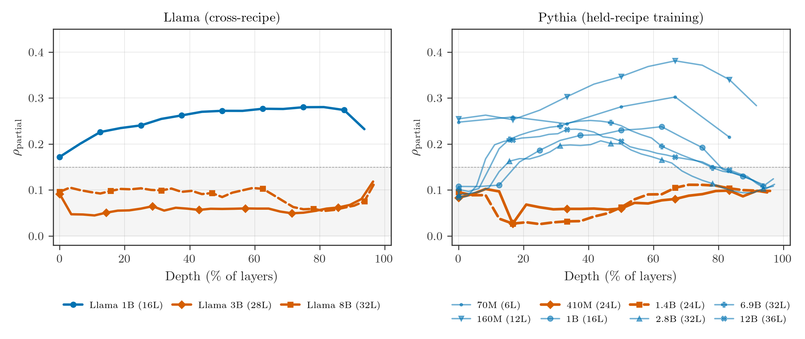
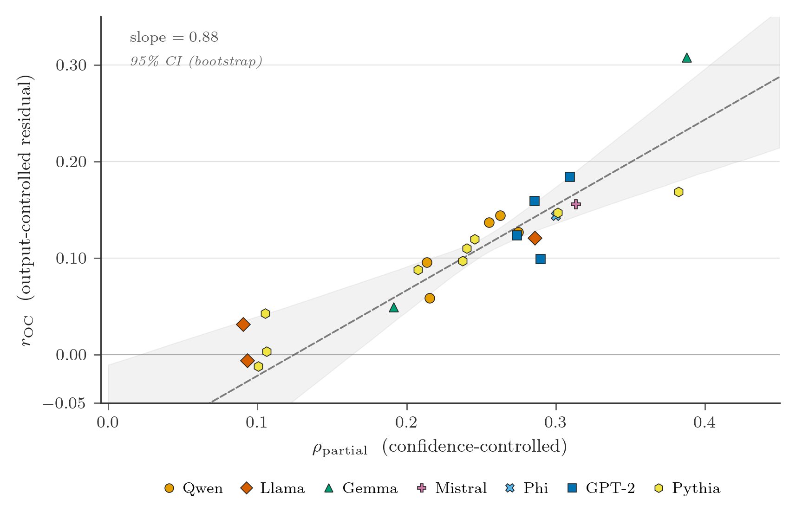

# Architecture Determines Observability in Transformers

**DOI:** [10.5281/zenodo.19435674](https://doi.org/10.5281/zenodo.19435674) | **License:** [MIT](LICENSE) | **Python:** 3.12+

#### 8 to 12% of confident model errors are invisible to the output distribution. Confidence thresholds miss them. Calibrated probabilities miss them. A trained predictor on the full output representation misses them. They reach users undetected.

A single dot product on frozen mid-layer activations catches them. No fine-tuning, no task-specific data. A probe trained on Wikipedia reads the same failure signal zero-shot on medical licensing questions and retrieval-augmented QA.

Which model you deploy determines whether this signal exists at all. The phenomenon has a name: **observability collapse**. At specific architecture configurations the mid-layer readable signal falls from +0.21 to +0.10 and stays there. No layer recovers it. A nonlinear probe does not recover it. The information is absent from the representation, not hidden from linear readout.

<p align="center">

</p>

Both panels are the same protocol, the same token budget per hidden dimension, and the same shaded detection band. Left panel, Llama 3.2 under a cross-recipe split: 1B preserves the signal, 3B and 8B do not. Right panel, Pythia under held-recipe training: three of eight configurations collapse, and all three are (24 layers, 16 heads). The replication is across a 3.5x parameter gap, two Pile variants (original and deduplicated), and two hidden dimensions. Six other Pythia depths are healthy. No intermediate values appear.

## What this repo contains

The code, data, and analysis behind [the paper](https://doi.org/10.5281/zenodo.19435674). Every number in the PDF traces to a committed JSON in `results/` through an automated verification pipeline.

```bash
# Install
git clone https://github.com/tmcarmichael/nn-observability
cd nn-observability
pip install -e .            # or: uv sync

# Verify
pytest tests/ -q            # CPU only, schema-parametrized across paper scope

# Run the full analysis (CPU, no GPU needed)
python analysis/run_all.py  # permutation test, mixed-effects, variance decomposition
```

## The finding

Half to two-thirds of what standard probes measure is confidence in disguise. Raw probe-loss correlation on GPT-2 124M is +0.55. After controlling for max softmax and activation norm: +0.28 survives. Four hand-designed activation statistics that show strong raw correlation all collapse to near zero under the same controls.

The signal that survives is real, linear, and output-independent. Twenty probe initializations converge to the same direction (+/- 0.001). A nonlinear MLP is statistically equivalent. A 512-unit output predictor absorbs no more than a 64-unit bottleneck. The information exists in the model's hidden layers, and the output layer discards it. Output-independence grows with scale: the residual signal is 34% at GPT-2 124M and 60% at GPT-2 XL.

Scale does not predict whether the signal is present. Configuration does. At matched 3B scale, Qwen produces +0.263 and Llama produces +0.091, a 2.9x gap with non-overlapping per-seed distributions. Within Llama 3.2, the signal is present at 1B (+0.286) and absent at 3B (+0.091) and 8B (+0.093). Under Pythia's held-recipe training, both (24 layers, 16 heads) configurations collapse to ~+0.10, with a third replication on the deduplicated Pile variant. Across 13 cross-family models, family membership explains 92% of the variance (permutation p = 0.006).

## The cross-family comparison

| Model        | Family    | Params | pcorr      | OC residual |
| ------------ | --------- | ------ | ---------- | ----------- |
| Gemma 3 1B   | Gemma     | 1B     | +0.388     | +0.307      |
| Mistral 7B   | Mistral   | 7B     | +0.313     | +0.156      |
| Phi-3 Mini   | Phi       | 3.8B   | +0.300     | +0.144      |
| GPT-2 XL     | GPT-2     | 1.5B   | +0.290     | +0.174      |
| Llama 1B     | Llama     | 1.2B   | +0.286     | +0.120      |
| Qwen 7B      | Qwen      | 7B     | +0.255     | +0.137      |
| **Llama 3B** | **Llama** | **3B** | **+0.091** | **+0.031**  |
| **Llama 8B** | **Llama** | **8B** | **+0.093** | **-0.007**  |

Sorted by signal strength. Every row except the bold Llama entries produces observability above +0.19. Within Llama, the signal is present at 1B (+0.286) and absent at 3B (+0.091). Same lab, same training pipeline, different architectural configuration. The full 13-model table with standard deviations, seed agreement, and random head baselines is in the [paper](https://doi.org/10.5281/zenodo.19435674).

<p align="center">

</p>

Across 22 models spanning seven families, the output-controlled residual tracks partial correlation with slope 0.88. Collapse points sit near the origin. A monitoring tool that reads the mid-layer signal exposes information the output representation does not carry, and this surplus is absent at exactly the configurations where the partial correlation vanishes.

## Run it on your model

```bash
pip install -e ".[transformer]"   # or: uv sync --extra transformer

python scripts/run_model.py \
  --model Qwen/Qwen2.5-7B \
  --output qwen7b_results.json
```

This runs the full protocol: layer sweep, 7-seed evaluation, output-controlled residual, cross-domain transfer, control sensitivity, and flagging analysis. Output is a self-contained JSON with provenance metadata. See `analysis/README.md` for the schema and how to add a new model to the analysis scope.

## Repository structure

```
src/                  Core library (probe, observer, experiment engine)
scripts/              GPU experiment launchers (run_model.py is the entry point)
analysis/             CPU statistical analysis (permutation test, mixed-effects, schema validation)
results/              All result JSONs (committed, reproducible, schema-validated)
figures/              Shared matplotlib style and save helper
tests/                Schema, metrics, analysis smoke, probe-sync drift guards
```

Full directory map and script descriptions in `analysis/README.md` and `results/README.md`.

## Citation

```bibtex
@software{carmichael2026architecture,
  title={Architecture Determines Observability in Transformers},
  author={Carmichael, Thomas},
  year={2026},
  version={3.0.0},
  doi={10.5281/zenodo.19435674},
  url={https://github.com/tmcarmichael/nn-observability}
}
```

## License

[MIT License](LICENSE)
