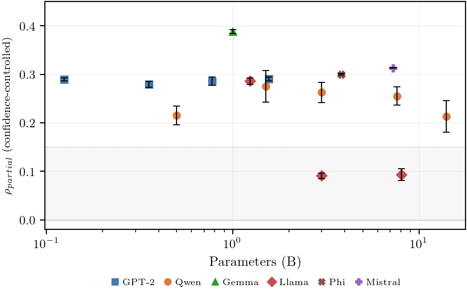

# Architecture Predicts Linear Readability of Decision Quality in Transformers

**DOI:** [10.5281/zenodo.19435674](https://doi.org/10.5281/zenodo.19435674) | **License:** [MIT](LICENSE) | **Python:** 3.12+

#### 8-11% of confident model errors are invisible to the output distribution. Confidence thresholds miss them. Calibrated probabilities miss them. A trained predictor on the full output representation misses them. They reach users undetected.

A single dot product on frozen mid-layer activations catches them. No fine-tuning, no task-specific data. A probe trained on Wikipedia reads the same failure signal zero-shot on medical licensing questions and retrieval-augmented QA.

Which model you deploy determines whether this signal exists. Five of six architecture families produce it. Llama does not. The difference is 2.9x at matched scale, and a permutation test across 13 models confirms family membership explains 92% of the variance (p = 0.006). The probe adds one dot product per token. Confidence monitoring adds zero information about these errors.

<p align="center">

</p>

## What this repo contains

The code, data, and analysis behind [the paper](https://doi.org/10.5281/zenodo.19435674). Every number in the PDF traces to a committed JSON in `results/` through an automated verification pipeline. 57 numerical claims are checked on every build.

```bash
# Install
git clone https://github.com/tmcarmichael/nn-observability
cd nn-observability
pip install -e .            # or: uv sync

# Verify
pytest tests/ -q            # 253 tests, CPU only

# Run the full analysis (CPU, no GPU needed)
python analysis/run_all.py  # permutation test, mixed-effects, variance decomposition
```

## The finding

Half to two-thirds of what standard probes measure is confidence in disguise. Raw probe-loss correlation on GPT-2 124M is +0.55. After controlling for max softmax and activation norm: +0.28 survives. Four hand-designed activation statistics that show strong raw correlation all collapse to near zero under the same controls.

The signal that survives is real, linear, and output-independent. Twenty probe initializations converge to the same direction (+/- 0.001). A nonlinear MLP is statistically equivalent. A 512-unit output predictor absorbs no more than a 64-unit bottleneck. The information exists in the model's hidden layers and the output layer discards it.

## The cross-family comparison

| Model        | Family    | Params | pcorr      | OC residual |
| ------------ | --------- | ------ | ---------- | ----------- |
| Gemma 3 1B   | Gemma     | 1B     | +0.388     | +0.307      |
| Mistral 7B   | Mistral   | 7B     | +0.313     | +0.156      |
| Phi-3 Mini   | Phi       | 3.8B   | +0.300     | +0.144      |
| GPT-2 XL     | GPT-2     | 1.5B   | +0.290     | +0.174      |
| Llama 1B     | Llama     | 1.2B   | +0.286     | +0.120      |
| Qwen 7B      | Qwen      | 7B     | +0.255     | +0.137      |
| **Llama 3B** | **Llama** | **3B** | **+0.091** | **+0.031**  |
| **Llama 8B** | **Llama** | **8B** | **+0.093** | **-0.007**  |

The table is sorted by signal strength. Every family except Llama above 1B produces observability above +0.19. Within Llama, the signal is present at 1B (+0.286) and absent at 3B (+0.091). Same lab, same training pipeline, different architectural configuration. The full 13-model table with standard deviations, seed agreement, and random head baselines is in the [paper](https://doi.org/10.5281/zenodo.19435674).

## Run it on your model

```bash
pip install -e ".[transformer]"   # or: uv sync --extra transformer

python scripts/run_model.py \
  --model Qwen/Qwen2.5-7B \
  --output qwen7b_results.json
```

This runs the full protocol: layer sweep, 7-seed evaluation, output-controlled residual, cross-domain transfer, control sensitivity, and flagging analysis. Output is a self-contained JSON with provenance metadata. See `analysis/README.md` for the schema and how to add a new model to the analysis scope.

## Repository structure

```
src/                  Core library (probe, observer, experiment engine)
scripts/              GPU experiment launchers (run_model.py is the entry point)
analysis/             CPU statistical analysis (permutation test, mixed-effects, verification)
results/              All result JSONs (committed, reproducible, schema-validated)
figures/              Paper figure generation
tests/                253 tests (schema, metrics, analysis smoke, probe sync)
```

Full directory map and script descriptions in `analysis/README.md` and `results/README.md`.

## Citation

```bibtex
@article{carmichael2026architecture,
  title={Architecture Predicts Linear Readability of Decision Quality in Transformers},
  author={Carmichael, Thomas},
  year={2026},
  doi={10.5281/zenodo.19435674},
  url={https://github.com/tmcarmichael/nn-observability}
}
```

## License

[MIT License](LICENSE)
